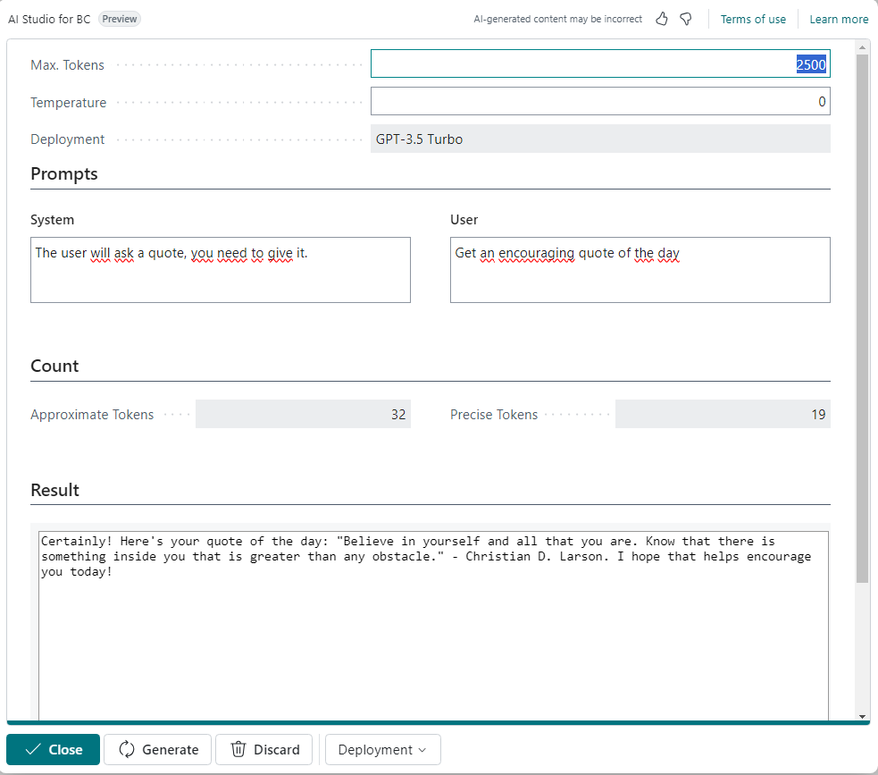

# AI Studio for Business Central

## Team information  

**Oxygen Group (Belgium)**

- Eric Wauters (waldo): Eric.Wauters@ifacto.be
- Gunter Peeters: Gunter.Peeters@ifacto.be
- Frank Neeckx: fn@astena.be
- Stieven Vermoesen: stv@astena.be

## Problem Statement
When exploring and testing the capabilities for BC Copilot, you need to play with the System and Userprompt very often.
Even a small word or a change in order can make a big difference in your results.
As we didn't had access to the AI Studio of Microsoft, we needed a quick playground in BC itself.

## Solution Overview

Name: Business Central AI Studio

Main Features:

**Interactive AI Playground**: A virtual environment where developers can experiment and optimize their system prompts and user prompts before implementing changes in their code.
**History Control**: Keeps a history of all attempts and iterations, allowing developers to track changes and revert to previous versions if necessary.
**Real-time Feedback**: Provides immediate feedback on prompt optimization, enabling developers to fine-tune their AI models efficiently.
**Customization Options**: Offers various customization options for prompts and parameters to tailor the AI model according to specific requirements.
**Analytics and Insights**: Provides analytics and insights into prompt effectiveness and user interactions to drive informed decision-making.

Benefits:

**Efficient Development Process**: Allows developers to experiment and refine AI models without directly modifying the code, saving time and resources.
**Improved Accuracy**: Enables developers to optimize prompts for better performance and user experience, leading to more accurate AI responses.
**Version Control**: Maintains a history of iterations, ensuring transparency and enabling easy tracking of changes.

Here, you can find a video: [https://github.com/OxygenGroupBE/AIHackathon2024/tree/main/BCAIStudio/Video](https://github.com/OxygenGroupBE/AIHackathon2024/tree/main/BCAIStudio/Video) 

Some screenshots:

## Accomplishments
We successfully developed a functional prototype, showcasing the core features such as interactive prompt optimization, history control, and real-time feedback.
We designed an intuitive and user-friendly interface with promptdialog, focusing on simplicity and ease of navigation to enhance the user experience.

## Impact 
Well, especially for developers:

The AI Studio empowers developers by providing them with a platform to experiment and optimize their AI models efficiently. By offering tools for prompt optimization, version control, and real-time feedback, developers can enhance the accuracy and performance of their AI systems, leading to better user experiences and outcomes.

By democratizing access to AI development tools and resources, the AI Studio fosters innovation within the developer community. Developers can freely explore new ideas, experiment with different approaches, and collaborate with peers, driving advancements in AI technology and applications.

## Project Continuation
I don't think this needs much further attention.  It would have been nice to have our own OpenAI subscription so we could test in the official AI Studio.  But at least this tool made us learn a lot, and be more efficient with the other solutions we did during the hackathon.

## Value Proposition 
The AI Studio offers a valuable platform for developers to experiment and optimize their AI models, enhancing the accuracy of their prompts, and thus the performance of their solutions. By providing tools for prompt optimization, version control, and real-time feedback, the AI Studio empowers developers to refine their AI models efficiently, leading to better user experiences and outcomes.

## Materials: Prototype / Pitch / Images 
- GitHub with all the materials: [https://github.com/OxygenGroupBE/AIHackathon2024](https://github.com/OxygenGroupBE/AIHackathon2024)
- GitHub URL to this specific app: [https://github.com/OxygenGroupBE/AIHackathon2024/tree/main/BCAIStudio](https://github.com/OxygenGroupBE/AIHackathon2024/tree/main/BCAIStudio)
- Video: [https://github.com/OxygenGroupBE/AIHackathon2024/tree/main/BCAIStudio/Video](https://github.com/OxygenGroupBE/AIHackathon2024/tree/main/BCAIStudio/Video)

## Comments
This project is just a small part of all our contributions during the Hackathon.  

Here, you can find the complete overview:  [https://github.com/OxygenGroupBE/AIHackathon2024/blob/main/ReadMe.md](https://github.com/OxygenGroupBE/AIHackathon2024/blob/main/ReadMe.md)