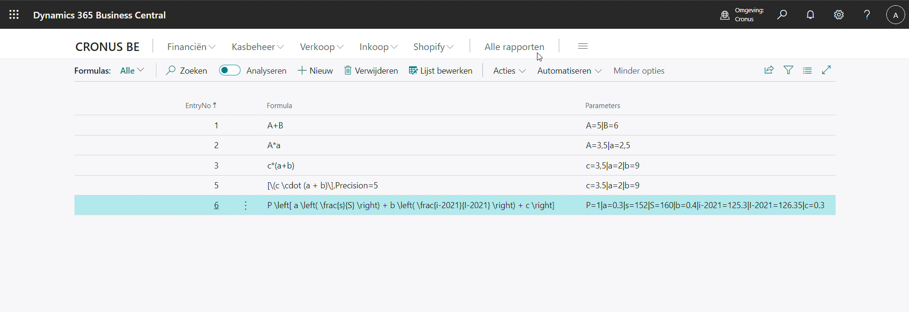
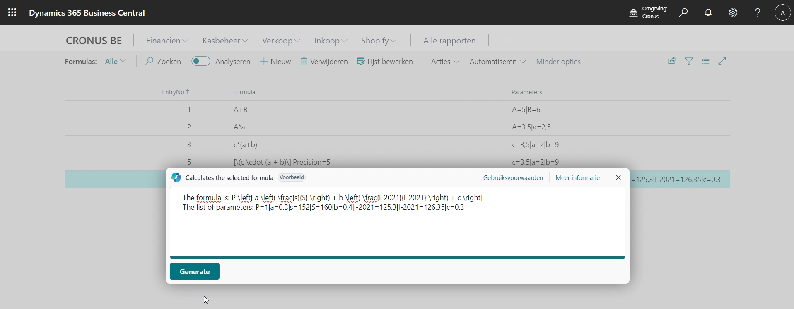
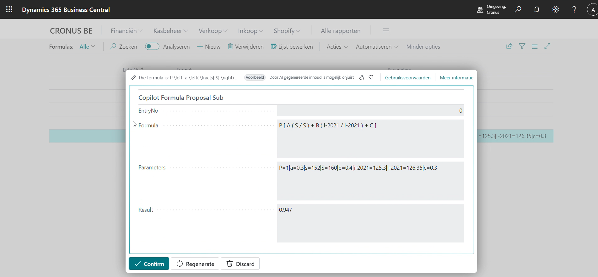

# Solve formulas with Copilot

## Team information  

**Oxygen Group (Belgium)**

- Eric Wauters (waldo): Eric.Wauters@ifacto.be
- Gunter Peeters: Gunter.Peeters@ifacto.be
- Frank Neeckx: fn@astena.be
- Stieven Vermoesen: stv@astena.be

## Problem Statement
When you need to process calculation formulas in AL it demands extensive develoment. Also, it usually has to be flexible: users tend to change formulas, parameters, ... .

## Solution Overview
This new module uses copilot to figure out the formula, and calculate the result. The module is intended to be an API, for other functionalities to benefit from it.

Name: Formulas with CoPilot
Main features: understanding formulas, and calculate result by providing parameters with values. 

Some screenshots:

A simple setup with formulas and parameters

Obviously, the point is that we can handle any formula - and this is merely a test-page, not really "functionality" as such.

The prompt:

The calculation:

The proof of concept works - now we would be able to implement this in real life scenarios.

## Accomplishments
Better understanding of how copilot handles different mathematical expressions.
Conclusion: it's not perfect, but pretty good.  When implemented in a framework, it can be a very usefull tool.

We now have a functional prototype/module/framework that can be used in certain use cases.

## Impact 
You don't need special development if you formula, parameters changes.
You can easily change parameters, value, formulas, ... 

## Project Continuation
A helpfull thing will be more information of how copilot handles/converts certain mathematical symbols.
Also, it would be helpful to be able to rely on input from the internet, like official indexations and such.  Online copilot can find them, but not what we had available in the product.

## Value Proposition 
Faster calculation of formulas with parameters. Easy setup. Very flexible, configurable formulas: users would be able to change the formula, and it would still work.

## Materials: Prototype / Pitch / Images 
- GitHub with all the materials: [https://github.com/OxygenGroupBE/AIHackathon2024](https://github.com/OxygenGroupBE/AIHackathon2024)
- GitHub URL to this specific app: [https://github.com/OxygenGroupBE/AIHackathon2024/tree/main/CoPilotFormulas](https://github.com/OxygenGroupBE/AIHackathon2024/tree/main/CoPilotFormulas)
- Video: [https://github.com/OxygenGroupBE/AIHackathon2024/tree/main/CoPilotFormulas/Video](https://github.com/OxygenGroupBE/AIHackathon2024/tree/main/CoPilotFormulas/Video)

## Comments
This project is just a small part of all our contributions during the Hackathon.  

Here, you can find the complete overview:  [https://github.com/OxygenGroupBE/AIHackathon2024/blob/main/ReadMe.md](https://github.com/OxygenGroupBE/AIHackathon2024/blob/main/ReadMe.md)