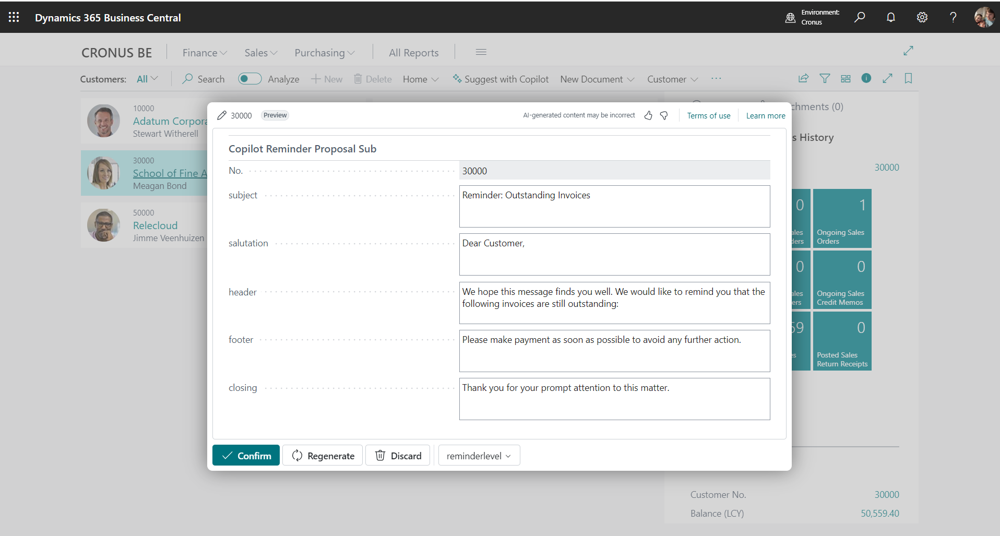
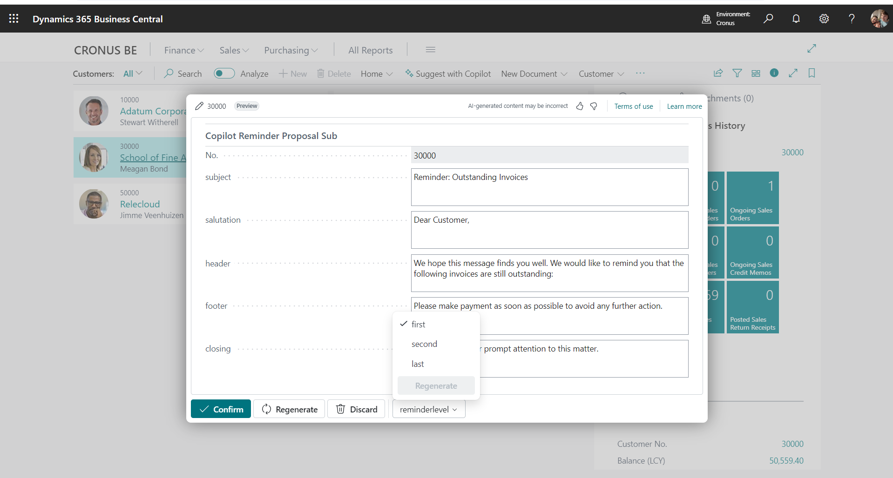
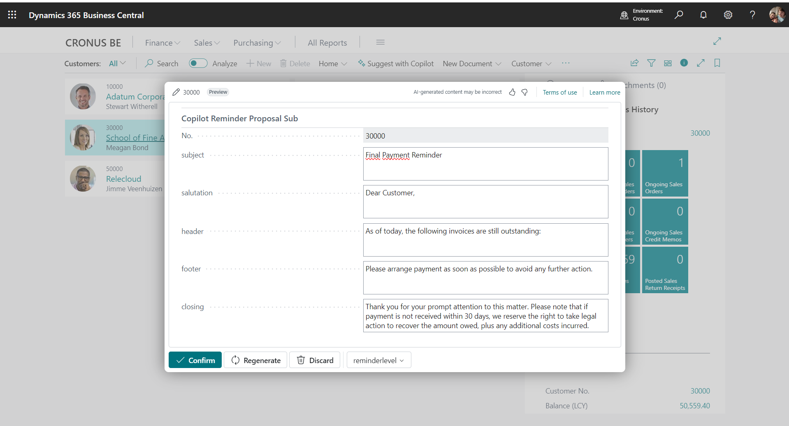
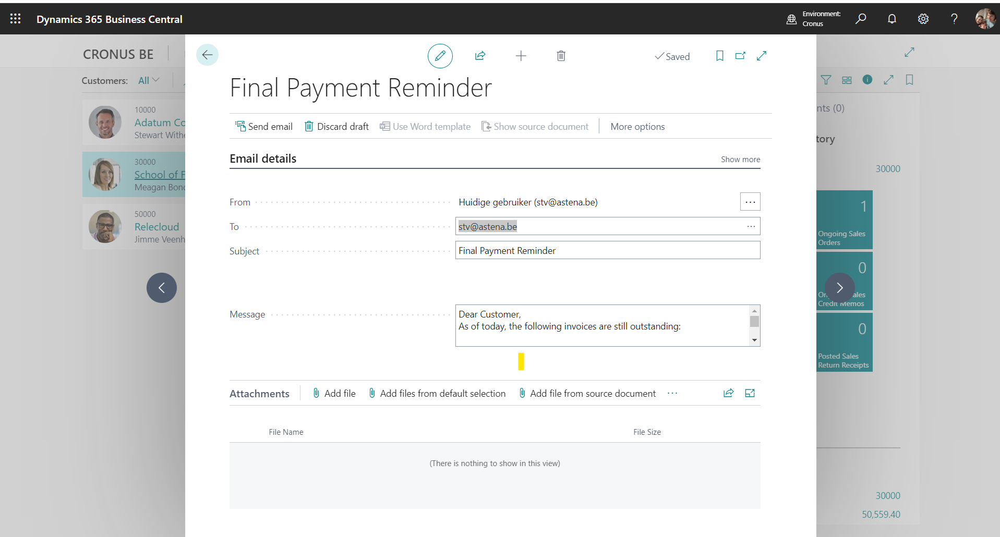
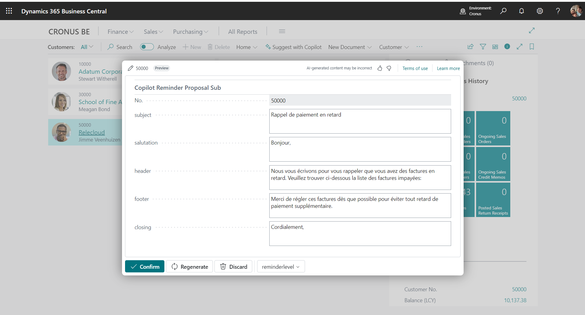

# Send Reminder mails with CoPilot

## Team information  

**Oxygen Group (Belgium)**

- Eric Wauters (waldo): Eric.Wauters@ifacto.be
- Gunter Peeters: Gunter.Peeters@ifacto.be
- Frank Neeckx: fn@astena.be
- Stieven Vermoesen: stv@astena.be

## Problem Statement
When you need to send reminders to customers, the mails sound too much the same.  Also, it usually has to be flexible:  the level of severity, the language, ... .

## Solution Overview
Dynamicaly generate reminder texts based on the reminder level input and the customer language. 

Name: Reminder mails with CoPilot

Main features: 
Generate a reminder text based on the customer language and change level of severity

levels:
- first: generates a polite reminder text
- second: generates a stronger reminder text
- last: generates a text with legal clause
  

Benefits :

You get a draft in a language you don't need to fully understand.
You can easily change the level of severity, and the language.

Some screenshots:

Creating a reminder for customer 30000

Customer has "English" as its language.

Different levels of reminders to set the tone:

Email the reminder:

For a French customer:

## Accomplishments

We have a better understanding of the translation capabilities of copilot, which is very powerful and interesting, but delicate.

## Impact 
You get a draft of a transleted reminder that you can send to the customer in the customer his language. If not the language should be English.

## Project Continuation
A guide about how to write prompts for copilot, would be very helpfull.
What are the effect of some words, the order, the.. .  It's not always clear how to write a prompt that will give you the result you want.

It would be nice if we would be able to "train" the model with examples of reminder texts, and the level of severity.

## Value Proposition 
Faster generating unique reminder texts with different tones. 
Easy setup.

## Materials: Prototype / Pitch / Images 
- GitHub with all the materials: [https://github.com/OxygenGroupBE/AIHackathon2024](https://github.com/OxygenGroupBE/AIHackathon2024)
- GitHub URL to this specific app: [https://github.com/OxygenGroupBE/AIHackathon2024/tree/main/CoPilotReminder](https://github.com/OxygenGroupBE/AIHackathon2024/tree/main/CoPilotReminder)
- Video: [Zipped video](https://github.com/OxygenGroupBE/AIHackathon2024/tree/main/CoPilotReminder/Video)

## Comments
This project is just a small part of all our contributions during the Hackathon.  

Here, you can find the complete overview:  [https://github.com/OxygenGroupBE/AIHackathon2024/blob/main/ReadMe.md](https://github.com/OxygenGroupBE/AIHackathon2024/blob/main/ReadMe.md)
