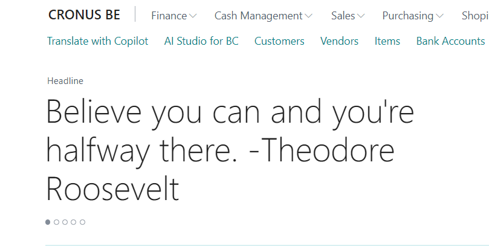

# Quote of the Day

## Team information  

**Oxygen Group (Belgium)**

- Eric Wauters (waldo): Eric.Wauters@ifacto.be
- Gunter Peeters: Gunter.Peeters@ifacto.be
- Frank Neeckx: fn@astena.be
- Stieven Vermoesen: stv@astena.be

## Problem Statement
Every morning when we opened Business Central for the first time, we missed some none work related stuff.
It was direct into business and there was no direct uplift to start you day.

## Solution Overview
To address the issue of starting the day without any uplifting or motivational content, we propose integrating a "Quote of the Day" feature into the role center of Business Central. This feature will display a new inspiring quote each day when users open the system for the first time in the morning

Here, you can find a video: [https://github.com/OxygenGroupBE/AIHackathon2024/tree/main/QuoteOfTheDay/Video](https://github.com/OxygenGroupBE/AIHackathon2024/tree/main/QuoteOfTheDay/Video) 

Some screenshots:

## Accomplishments
We successfully developed a functional prototype, giving the user a boost to start the day.

## Impact 
By implementing a "Quote of the Day" feature in the role center of Business Central, users will start their day with a positive and motivational message, fostering a more uplifting and engaging work environment.

## Project Continuation
I don't think this needs much further attention.  

## Value Proposition 
There is nothing better than a happy employee. And who don't like to make another person happy!!!

## Materials: Prototype / Pitch / Images 
- GitHub with all the materials: [https://github.com/OxygenGroupBE/AIHackathon2024](https://github.com/OxygenGroupBE/AIHackathon2024)
- GitHub URL to this specific app: [https://github.com/OxygenGroupBE/AIHackathon2024/tree/main/QuoteOfTheDay](https://github.com/OxygenGroupBE/AIHackathon2024/tree/main/QuoteOfTheDay)
- Video: [https://github.com/OxygenGroupBE/AIHackathon2024/tree/main/QuoteOfTheDay/Video](https://github.com/OxygenGroupBE/AIHackathon2024/tree/main/QuoteOfTheDay/Video)

## Comments
This project is just a small part of all our contributions during the Hackathon.  

Here, you can find the complete overview:  [https://github.com/OxygenGroupBE/AIHackathon2024/blob/main/ReadMe.md](https://github.com/OxygenGroupBE/AIHackathon2024/blob/main/ReadMe.md)