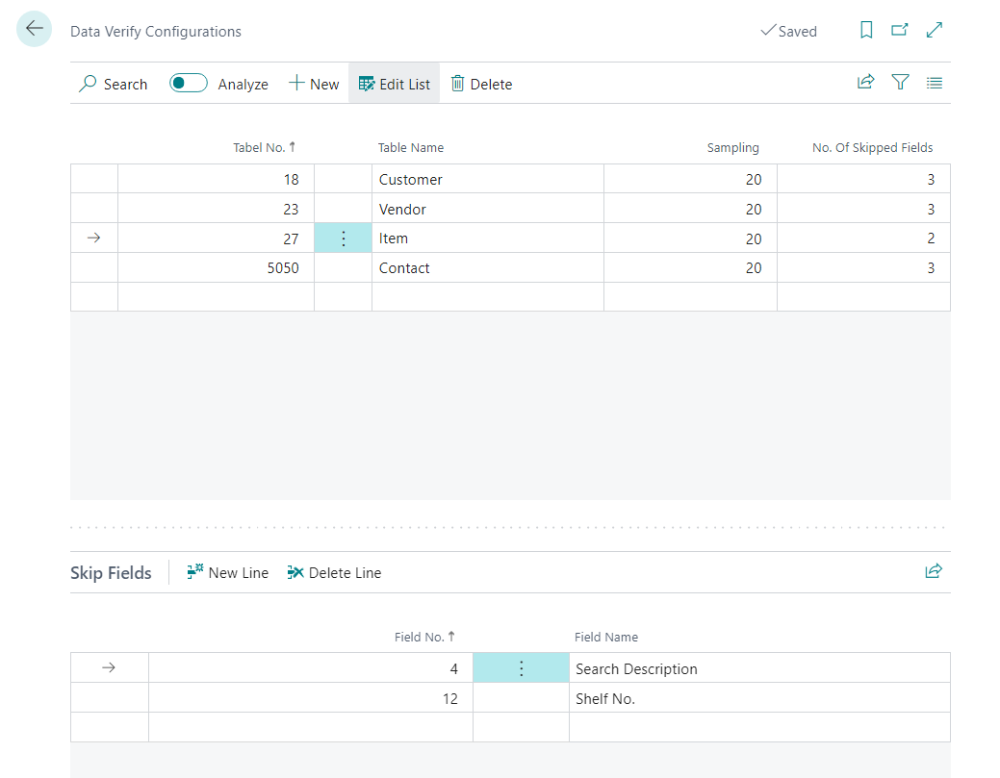
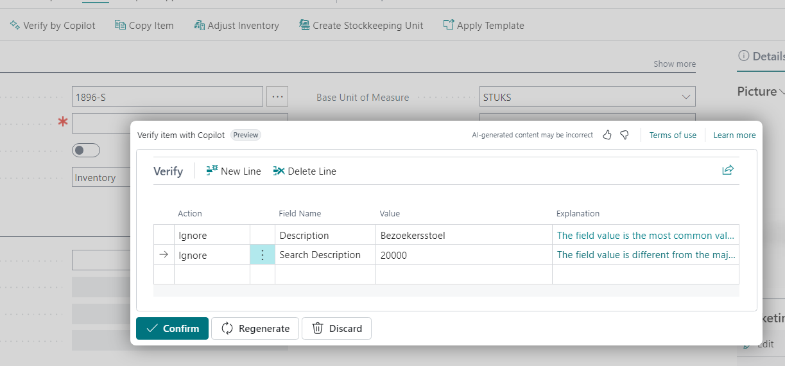
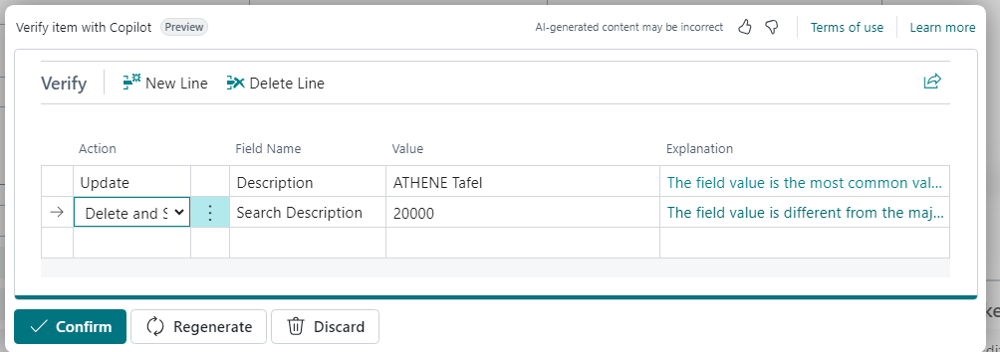
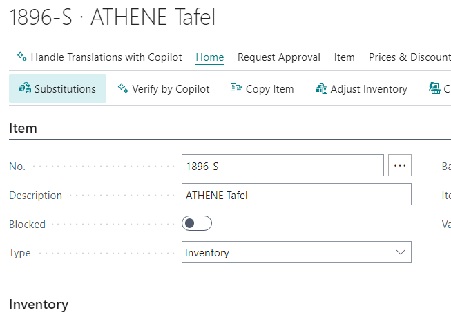

# Verify Master Data with Copilot

## Team information  

**Oxygen Group (Belgium)**

- Eric Wauters (waldo): Eric.Wauters@ifacto.be
- Gunter Peeters: Gunter.Peeters@ifacto.be
- Frank Neeckx: fn@astena.be
- Stieven Vermoesen: stv@astena.be

## Problem Statement
Maintaining, checking and supervising Master Data can be a big change within an organisation. Definitely when multiple users are handling it.
Every user can make mistakes or forget to fill up some fields.
In the past a poweruser must check every new or updated record manually. This can be a very time consuming task.

## Solution Overview
Main Features:

Automated data validation and verification processes
User-friendly interface for seamless data entry and management
Real-time notifications for incomplete or erroneous data entries

Benefits:

Streamlined data maintenance process, reducing manual effort and errors
Improved data accuracy and integrity through automated validation
Enhanced efficiency as power users can focus on strategic tasks rather than routine checks
Increased user satisfaction with a smoother and more reliable data management system

Some screenshots:

To use our solutions, you need to first make some configurations. Currently we support item, customer, vendor and contact tables. Per table you can config how many samples the system must give to copilot to do the verification. Next you also have the ability to skip unnecessary fields in the process. 

The process can currently be triggered from the card but the building blocks are there to plug it in elsewhere. 
In this example copilot as found that the Description is usually filled in and the Search Description is wrong.

For this item we change the suggested Description and as you can see the Action will change. Next the Search Description must not be updated in the future so we decide to Delete and skip this.

And after we confirm the proposal the item is updated.

## Accomplishments
We achieved to develop a functional prototype, showcasing the core features. It implements automated data validation and verification processes, reducing manual workload. It might need some more tweaking, but the current prompting seems to generate very useful data most of the time already.

## Impact 
Our solution will save time and effort for users through automation.
Improving data accuracy and integrity.

## Project Continuation
To make this project fully functional we need to finetuning the system prompt to make the data validation and verification proposals more reliabel. 

## Value Proposition 
Our solution help users to make better and complete data and gives powerusers more time to focus on strategic tasks rather than routine checks. 

## Materials: Prototype / Pitch / Images 
- GitHub with all the materials: [https://github.com/OxygenGroupBE/AIHackathon2024](https://github.com/OxygenGroupBE/AIHackathon2024)
- GitHub URL to this specific app: [https://github.com/OxygenGroupBE/AIHackathon2024/tree/main/VerifyMasterData](https://github.com/OxygenGroupBE/AIHackathon2024/tree/main/VerifyMasterData)
- Video: [https://github.com/OxygenGroupBE/AIHackathon2024/tree/main/VerifyMasterData/Video](https://github.com/OxygenGroupBE/AIHackathon2024/tree/main/VerifyMasterData/Video)

## Comments
This project is just a small part of all our contributions during the Hackathon.  

Here, you can find the complete overview:  [https://github.com/OxygenGroupBE/AIHackathon2024/blob/main/ReadMe.md](https://github.com/OxygenGroupBE/AIHackathon2024/blob/main/ReadMe.md)